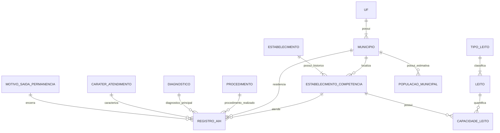
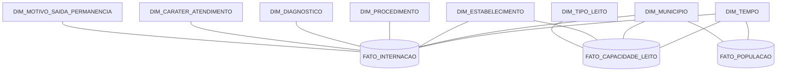

# Modelagem Acadêmica — Capítulos 1 e 2

## Status

**Fechada para revisão gráfica e redação da primeira entrega**

Base factual:

- `docs/discovery/feasibility.md`;
- `docs/discovery/dataset-validation.md`;
- `docs/project/current-state.md`;
- material oficial da disciplina.

Este documento transforma as evidências da Discovery em uma especificação acadêmica coerente para os Capítulos 1 e 2.

Não representa implementação QlikView.

---

# 1. Problema de negócio

O Data Mart deve apoiar análise descritiva e comparativa da relação entre:

- demanda hospitalar processada pelo SIH/SUS;
- capacidade hospitalar cadastrada no CNES;
- população municipal estimada pelo IBGE;

com foco nos atendimentos realizados na Paraíba no período de 2017 a 2019.

As análises devem permitir comparar volume de internações, capacidade de leitos, população e fluxos entre município de residência e município de atendimento.

Não inferir causalidade a partir dessas associações.

---

# 2. Regras de negócio

## RN01 — Período analítico

O período do Data Mart será **2017–2019**.

## RN02 — Escopo geográfico da demanda

A demanda hospitalar será representada pelos registros SIH/RD processados para atendimentos realizados na Paraíba.

## RN03 — Unidade administrativa da demanda

Cada linha do SIH/RD representa um **registro administrativo de AIH processada**.

Não interpretar automaticamente uma linha como paciente único ou episódio clínico único.

## RN04 — Continuidade de longa permanência

Registros `IDENT=5` representam continuidade e não contam como nova internação.

## RN05 — Identificação do registro de internação

`N_AIH` não é chave única do registro.

O modelo deverá possuir uma chave técnica própria para cada registro, preservando os identificadores necessários para rastreabilidade da origem.

## RN06 — Município de residência e atendimento

Município de residência e município de atendimento são papéis distintos.

O mesmo município pode aparecer em ambos os papéis, mas os conceitos não devem ser confundidos.

## RN07 — Correspondência municipal

Códigos municipais DATASUS e IBGE serão integrados por uma correspondência oficial validada.

Não calcular artificialmente o sétimo dígito do código IBGE.

## RN08 — Estabelecimento

O estabelecimento é identificado pelo código CNES.

Seus atributos descritivos podem mudar ao longo do tempo e devem ser interpretados no contexto da competência correspondente.

## RN09 — Capacidade de leitos

A capacidade será registrada na granularidade:

**estabelecimento × competência mensal × código de leito.**

## RN10 — Medidas de capacidade

As medidas principais são:

- quantidade de leitos existentes;
- quantidade de leitos SUS.

Quantidade de leitos não SUS pode ser derivada quando apropriado.

## RN11 — Semi-aditividade dos leitos

Leitos são snapshots mensais.

Somar as quantidades de janeiro e fevereiro não representa a capacidade conjunta dos dois meses.

Para indicadores anuais, utilizar medida compatível com snapshots, preferencialmente a média dos 12 meses.

## RN12 — População

A população será registrada na granularidade:

**município × ano.**

## RN13 — Semi-aditividade da população

Populações de anos distintos não devem ser somadas.

## RN14 — Internações por 1.000 habitantes

O indicador deve relacionar:

- internações de residentes no município;
- população estimada do mesmo município;
- mesmo ano de referência.

## RN15 — Leitos SUS por 1.000 habitantes

O indicador deve relacionar:

- capacidade SUS no município de localização do estabelecimento;
- população do município;
- período compatível.

## RN16 — Relação internações/leito

A relação entre internações e leitos poderá ser utilizada como indicador descritivo de demanda/capacidade.

Não denominá-la taxa de ocupação.

## RN17 — Procedimento

Na primeira versão, o procedimento de análise será o procedimento realizado `PROC_REA`.

`PROC_SOLIC` será preservado na origem e poderá ser incorporado ao modelo posteriormente se necessário.

## RN18 — Diagnóstico

Na primeira versão será utilizado o diagnóstico principal `DIAG_PRINC`.

Diagnósticos secundários ficam fora do escopo inicial.

## RN19 — Tempo

Competência, data de internação e data de saída são papéis temporais diferentes.

## RN20 — Residentes externos

Registros de residentes de outros estados podem participar da análise de fluxo para a Paraíba.

Não associá-los automaticamente à população municipal da Paraíba.

## RN21 — Preservação do CNES/LT

Todos os registros válidos de leitos serão preservados no processo de capacidade.

O recorte estritamente hospitalar será representado por classificação do estabelecimento, evitando perda antecipada de registros válidos.

---

# 3. Modelo conceitual

## 3.1 Entidades

### UF

Representa a unidade federativa à qual o município pertence.

### MUNICIPIO

Representa o município utilizado para localização, residência, atendimento e população.

### ESTABELECIMENTO

Representa a identidade do estabelecimento de saúde por código CNES.

### ESTABELECIMENTO_COMPETENCIA

Representa o estado histórico dos atributos de um estabelecimento em uma competência.

### REGISTRO_AIH

Representa um registro administrativo processado no SIH/RD.

### PROCEDIMENTO

Representa o procedimento hospitalar associado ao registro.

### DIAGNOSTICO

Representa o diagnóstico principal associado ao registro.

### CARATER_ATENDIMENTO

Representa o caráter do atendimento registrado no SIH.

### MOTIVO_SAIDA_PERMANENCIA

Representa o domínio do motivo de saída/permanência associado ao registro.

### TIPO_LEITO

Representa a classificação superior dos leitos do CNES.

### LEITO

Representa o código/detalhamento do leito dentro de um tipo.

### CAPACIDADE_LEITO

Representa a quantidade de leitos de um determinado código em um estabelecimento e competência.

### POPULACAO_MUNICIPAL

Representa a estimativa populacional de um município em um ano.

---

## 3.2 Relacionamentos e cardinalidades

| Relacionamento | Cardinalidade |
|---|---|
| UF — MUNICIPIO | UF (1,n) ↔ MUNICIPIO (1,1) |
| MUNICIPIO — ESTABELECIMENTO_COMPETENCIA | MUNICIPIO (0,n) ↔ ESTABELECIMENTO_COMPETENCIA (1,1) |
| ESTABELECIMENTO — ESTABELECIMENTO_COMPETENCIA | ESTABELECIMENTO (1,n) ↔ ESTABELECIMENTO_COMPETENCIA (1,1) |
| ESTABELECIMENTO_COMPETENCIA — REGISTRO_AIH | ESTABELECIMENTO_COMPETENCIA (0,n) ↔ REGISTRO_AIH (1,1) |
| MUNICIPIO — REGISTRO_AIH, papel residência | MUNICIPIO (0,n) ↔ REGISTRO_AIH (1,1) |
| PROCEDIMENTO — REGISTRO_AIH | PROCEDIMENTO (0,n) ↔ REGISTRO_AIH (1,1) |
| DIAGNOSTICO — REGISTRO_AIH | DIAGNOSTICO (0,n) ↔ REGISTRO_AIH (1,1) |
| CARATER_ATENDIMENTO — REGISTRO_AIH | CARATER_ATENDIMENTO (0,n) ↔ REGISTRO_AIH (1,1) |
| MOTIVO_SAIDA_PERMANENCIA — REGISTRO_AIH | MOTIVO (0,n) ↔ REGISTRO_AIH (1,1) |
| TIPO_LEITO — LEITO | TIPO_LEITO (1,n) ↔ LEITO (1,1) |
| LEITO — CAPACIDADE_LEITO | LEITO (0,n) ↔ CAPACIDADE_LEITO (1,1) |
| ESTABELECIMENTO_COMPETENCIA — CAPACIDADE_LEITO | ESTABELECIMENTO_COMPETENCIA (0,n) ↔ CAPACIDADE_LEITO (1,1) |
| MUNICIPIO — POPULACAO_MUNICIPAL | MUNICIPIO (0,n) ↔ POPULACAO_MUNICIPAL (1,1) |

### Fechamento da cardinalidade de encerramento

A relação com `MOTIVO_SAIDA_PERMANENCIA` é tratada como obrigatória no modelo acadêmico: cada `REGISTRO_AIH` possui exatamente um motivo de saída/permanência. O layout oficial do SISAIH01 contém o campo `MOT_SAÍDA` para AIH principal/continuação/longa permanência, e os checkpoints reais inspecionados apresentaram preenchimento integral. A carga dos 36 meses deverá revalidar essa regra como controle de implementação, sem bloquear o modelo acadêmico.

---

## 3.3 Fonte Mermaid para o DER conceitual



O diagrama final da entrega deverá ser exportado em formato gráfico adequado para impressão.

---

# 4. Modelo lógico relacional normalizado

## 4.1 UF

Chave primária:

- `cod_uf`.

Atributos candidatos:

- `sigla_uf`;
- `nome_uf`.

---

## 4.2 MUNICIPIO

Chave primária:

- `cod_ibge_7`.

Chave alternativa:

- `cod_datasus_6`.

Atributos:

- `nome_municipio`;
- `cod_uf` — FK para UF.

---

## 4.3 ESTABELECIMENTO

Chave primária:

- `cnes`.

A entidade representa a identidade permanente do cadastro.

---

## 4.4 ESTABELECIMENTO_COMPETENCIA

Chave primária composta:

- `cnes`;
- `competencia`.

Chaves estrangeiras:

- `cnes` → ESTABELECIMENTO;
- `cod_ibge_7` → MUNICIPIO.

Atributos candidatos validados no ST:

- `tp_unid`;
- `tp_gestao`;
- `nat_jur`;
- `vinc_sus`;
- `cnpj_mantenedora`;
- `cep`.

Nome fantasia/razão social permanece como enriquecimento oficial pendente.

---

## 4.5 PROCEDIMENTO

Chave primária:

- `cod_procedimento`.

Atributos:

- descrição oficial.

Outras hierarquias do SIGTAP somente serão adicionadas depois de validação explícita da referência utilizada.

---

## 4.6 DIAGNOSTICO

Chave primária:

- `cod_diagnostico`.

Atributos:

- descrição oficial.

Outras hierarquias CID somente serão adicionadas após validação explícita.

---

## 4.7 CARATER_ATENDIMENTO

Chave primária:

- `cod_carater`.

Atributos:

- descrição oficial.

---

## 4.8 MOTIVO_SAIDA_PERMANENCIA

Chave primária:

- `cod_motivo`.

Atributos:

- descrição oficial.

---

## 4.9 TIPO_LEITO

Chave primária:

- `cod_tipo_leito`.

Atributos:

- descrição oficial do tipo.

---

## 4.10 LEITO

Chave primária:

- `cod_leito`.

Chave estrangeira:

- `cod_tipo_leito` → TIPO_LEITO.

Atributos:

- descrição/especialidade oficial do leito.

---

## 4.11 REGISTRO_AIH

Chave primária:

- `id_registro_aih` — chave técnica.

Chave estrangeira composta:

- `cnes + competencia` → ESTABELECIMENTO_COMPETENCIA.

Demais chaves estrangeiras:

- `cod_municipio_residencia` → MUNICIPIO;
- `cod_procedimento` → PROCEDIMENTO;
- `cod_diagnostico` → DIAGNOSTICO;
- `cod_carater` → CARATER_ATENDIMENTO;
- `cod_motivo` → MOTIVO_SAIDA_PERMANENCIA.

Atributos operacionais candidatos:

- arquivo/remessa/sequência de origem;
- `n_aih`;
- `ident`;
- `dt_inter`;
- `dt_saida`;
- `dias_perm`;
- `val_tot`;
- `morte`.

O município de atendimento não precisa ser duplicado no modelo lógico quando for derivável do estado do estabelecimento na competência.

---

## 4.12 CAPACIDADE_LEITO

Chave primária composta:

- `cnes`;
- `competencia`;
- `cod_leito`.

Chaves estrangeiras:

- `cnes + competencia` → ESTABELECIMENTO_COMPETENCIA;
- `cod_leito` → LEITO.

Medidas:

- `qt_exist`;
- `qt_sus`.

---

## 4.13 POPULACAO_MUNICIPAL

Chave primária composta:

- `cod_ibge_7`;
- `ano`.

Chave estrangeira:

- `cod_ibge_7` → MUNICIPIO.

Medida:

- `populacao`.

---

# 5. Modelo dimensional

## 5.1 Estrutura escolhida

**Star Schema em cada processo factual, com dimensões conformadas compartilhadas.**

O conjunto completo possui múltiplas fatos e, portanto, pode ser descrito tecnicamente como uma **constelação de esquemas estrela (fact constellation/galaxy)**. Para a escolha exigida pela disciplina, a estrutura adotada continua sendo **Estrela**, pois as dimensões não são normalizadas em Snowflake.

Existem três processos factuais com granularidades diferentes:

1. internações;
2. capacidade de leitos;
3. população.

As três fatos não serão fundidas em uma única tabela.

---

# 6. FATO_INTERNACAO

Granularidade:

**1 linha = 1 registro RD / AIH processada.**

Chave técnica:

- `SK_REGISTRO_INTERNACAO`.

Chaves dimensionais candidatas:

- `SK_TEMPO_COMPETENCIA`;
- `SK_TEMPO_INTERNACAO`;
- `SK_TEMPO_SAIDA`;
- `SK_MUNICIPIO_RESIDENCIA`;
- `SK_MUNICIPIO_ATENDIMENTO`;
- `SK_ESTABELECIMENTO`;
- `SK_PROCEDIMENTO`;
- `SK_DIAGNOSTICO`;
- `SK_CARATER_ATENDIMENTO`;
- `SK_MOTIVO_SAIDA_PERMANENCIA`.

Identificadores/flags operacionais:

- `N_AIH`, preservado para rastreabilidade e análise, não como PK;
- `IDENT`.

Medidas candidatas:

- `QTD_REGISTRO_AIH = 1`;
- `QTD_INTERNACAO = 1` para registros que contam como nova internação e `0` para continuidade;
- `DIAS_PERMANENCIA`;
- `VALOR_TOTAL`;
- `INDICADOR_OBITO`.

---

# 7. FATO_CAPACIDADE_LEITO

Granularidade:

**1 linha = estabelecimento × competência × código de leito.**

Chaves dimensionais candidatas:

- `SK_TEMPO_COMPETENCIA`;
- `SK_MUNICIPIO_LOCALIZACAO`;
- `SK_ESTABELECIMENTO`;
- `SK_TIPO_LEITO`.

Medidas:

- `QTD_LEITOS_EXISTENTES`;
- `QTD_LEITOS_SUS`.

Medida derivada:

- `QTD_LEITOS_NAO_SUS = QTD_LEITOS_EXISTENTES - QTD_LEITOS_SUS`, quando aplicável.

Classificação:

**semi-aditiva no tempo.**

---

# 8. FATO_POPULACAO

Granularidade:

**1 linha = município × ano.**

Chaves dimensionais candidatas:

- `SK_TEMPO_ANO`;
- `SK_MUNICIPIO`.

Medida:

- `POPULACAO_ESTIMADA`.

Classificação:

**semi-aditiva no tempo.**

---

# 9. Dimensões conformadas

## DIM_TEMPO

Papéis:

- competência da internação;
- data de internação;
- data de saída;
- competência do CNES;
- ano de referência populacional.

Atributos de calendário serão definidos a partir das datas reais e da necessidade analítica, sem criar níveis não utilizados.

---

## DIM_MUNICIPIO

Atributos mínimos candidatos:

- `SK_MUNICIPIO`;
- código IBGE de 7 dígitos;
- código DATASUS de 6 dígitos;
- nome do município;
- UF.

Papéis:

- município de residência;
- município de atendimento;
- município de localização do estabelecimento;
- município da população.

---

## DIM_ESTABELECIMENTO

Atributos candidatos:

- `SK_ESTABELECIMENTO`;
- CNES;
- tipo de estabelecimento;
- tipo de gestão;
- natureza jurídica;
- vínculo SUS;
- CNPJ mantenedora;
- CEP;
- nome fantasia/razão social quando a fonte histórica oficial for incorporada;
- classificação para o recorte estritamente hospitalar.

### Historização

A dimensão deverá preservar versões históricas dos atributos relevantes.

A técnica concreta de SCD será definida na implementação, mas o modelo não poderá aplicar retroativamente atributos de competências posteriores.

---

## DIM_PROCEDIMENTO

Atributos aprovados:

- `SK_PROCEDIMENTO`;
- código do procedimento;
- nome do procedimento;
- descrição oficial;
- grupo;
- subgrupo;
- forma de organização.

O SIGTAP organiza a Tabela de Procedimentos em Grupo → Subgrupo → Forma de Organização → Procedimento. O código possui 10 dígitos e o procedimento é o menor nível de agregação. A vigência/competência da referência utilizada deverá ser preservada durante o ETL, pois o SIGTAP mantém validade e alterações por competência.

---

## DIM_DIAGNOSTICO

Atributos aprovados:

- `SK_DIAGNOSTICO`;
- código CID-10;
- descrição oficial do diagnóstico.

O diagnóstico principal do SIH será interpretado segundo a CID-10. O escopo inicial permanece restrito ao diagnóstico principal; diagnósticos secundários não compõem a primeira versão do modelo.

---

## DIM_CARATER_ATENDIMENTO

Atributos:

- `SK_CARATER_ATENDIMENTO`;
- código;
- descrição oficial.

Domínio oficial aplicável ao SIH/SIA:

| Código | Descrição |
|---|---|
| 01 | Eletivo |
| 02 | Urgência |
| 03 | Acidente no local de trabalho ou a serviço da empresa |
| 04 | Acidente no trajeto para o trabalho |
| 05 | Outros tipos de acidente de trânsito |
| 06 | Outros tipos de lesões e envenenamentos por agentes químicos ou físicos |

Os checkpoints analisados apresentaram apenas parte desse domínio (`01`, `02`, `05` e `06`), mas a dimensão deve representar o domínio oficial e não apenas os valores observados na amostra.

---

## DIM_MOTIVO_SAIDA_PERMANENCIA

Atributos:

- `SK_MOTIVO_SAIDA_PERMANENCIA`;
- código;
- descrição oficial;
- categoria de encerramento.

A Portaria SAS/MS nº 719/2007 definiu a Tabela Auxiliar de Motivo de Saída/Permanência, posteriormente denominada Tabela Auxiliar de Encerramento. As categorias incluem alta, permanência, transferência, óbito e outros motivos. Atualizações posteriores introduziram/alteraram códigos usados no período, incluindo motivos obstétricos e transferência para internação domiciliar.

No arquivo RD os códigos aparecem sem o ponto da apresentação normativa, por exemplo `11` para `1.1`, `41` para `4.1` e `61` para `6.1`.

---

## DIM_TIPO_LEITO

Atributos aprovados:

- `SK_TIPO_LEITO`;
- código do tipo de leito;
- descrição do tipo;
- código do leito;
- descrição/especialidade do leito.

A relação normalizada TIPO_LEITO → LEITO será desnormalizada nesta dimensão.

---

# 10. Matriz fato × dimensão

| Dimensão | FATO_INTERNACAO | FATO_CAPACIDADE_LEITO | FATO_POPULACAO |
|---|:---:|:---:|:---:|
| DIM_TEMPO | ✓ | ✓ | ✓ |
| DIM_MUNICIPIO | ✓ | ✓ | ✓ |
| DIM_ESTABELECIMENTO | ✓ | ✓ | — |
| DIM_PROCEDIMENTO | ✓ | — | — |
| DIM_DIAGNOSTICO | ✓ | — | — |
| DIM_CARATER_ATENDIMENTO | ✓ | — | — |
| DIM_MOTIVO_SAIDA_PERMANENCIA | ✓ | — | — |
| DIM_TIPO_LEITO | — | ✓ | — |

---

# 11. Fonte Mermaid para visão dimensional



No desenho final, os papéis múltiplos de Tempo e Município deverão ser identificados textualmente.

---

# 12. Justificativa Star Schema

O Star Schema foi escolhido para cada processo factual porque:

- as dimensões são relativamente pequenas em relação às fatos;
- reduz a quantidade de joins;
- favorece entendimento do usuário final;
- é compatível com a análise associativa esperada no QlikView;
- hierarquias simples, como UF dentro de Município e Tipo dentro de Leito, podem ser desnormalizadas;
- não há benefício demonstrado que justifique o aumento de complexidade de um Snowflake no escopo atual.

O modelo lógico do Capítulo 1 permanece normalizado.

A desnormalização ocorre deliberadamente apenas na camada dimensional do Capítulo 2.

A presença de três tabelas fato compartilhando dimensões conformadas não caracteriza Snowflake; representa uma constelação de estrelas.

---

# 13. Indicadores derivados

## Internações por 1.000 habitantes

```text
(Internações de residentes no município e ano / População estimada do município e ano) × 1.000
```

## Leitos SUS por 1.000 habitantes

```text
(Média mensal de leitos SUS no município e ano / População estimada do município e ano) × 1.000
```

## Relação internações por leito

```text
Internações realizadas no município e período / Capacidade média de leitos no mesmo município e período
```

Não denominar essa relação taxa de ocupação.

## Fluxo residência → atendimento

Comparar município de residência com município de atendimento para identificar deslocamento e concentração dos atendimentos.

---

# 14. Decisões ainda pendentes

Estas pendências não impedem o desenho acadêmico atual:

1. fonte histórica definitiva para nome fantasia/razão social do estabelecimento;
2. técnica concreta de historização de `DIM_ESTABELECIMENTO` na implementação;
3. materializar no ETL as tabelas oficiais de referência por competência para SIGTAP/CID/CNES;
4. comportamento de indicadores de valor/permanência quando os 36 meses forem carregados;
5. representação física das dimensões role-playing no QlikView;
6. scripts de extração, transformação, QVD e painel.

---

# 15. Fechamento semântico dos modelos

A revisão semântica confirmou:

- procedimento: SIGTAP como fonte oficial, com código de 10 dígitos, nome, descrição, hierarquia Grupo/Subgrupo/Forma de Organização e vigência por competência;
- diagnóstico: CID-10 como terminologia do diagnóstico principal;
- caráter de atendimento: domínio oficial de seis códigos definido para SIH/SIA;
- motivo de saída/permanência: domínio oficial de encerramento com categorias de alta, permanência, transferência, óbito e outros motivos, incluindo atualizações históricas vigentes antes do período do projeto;
- leitos: CNES distingue Tipo de Leito, detalhamento/especialidade, Leitos Existentes e Leitos SUS;
- estabelecimento: CNES confirma CNES, tipo, razão social e nome fantasia como atributos cadastrais; a fonte histórica completa do nome por competência permanece como enriquecimento de implementação.

## Fontes oficiais de referência

- SIGTAP — Procedimento: https://wiki.saude.gov.br/sigtap/index.php/Procedimento
- SIGTAP — estrutura e atributos gerais: https://wiki.saude.gov.br/sigtap/index.php/P%C3%A1gina_principal
- Portaria SAS/MS nº 719/2007 — Caráter e Motivo de Saída/Permanência: https://bvsms.saude.gov.br/bvs/saudelegis/sas/2007/prt0719_28_12_2007.html
- Portaria SAS/MS nº 384/2010 — atualizações da Tabela de Encerramento: https://bvsms.saude.gov.br/bvs/saudelegis/sas/2010/prt0384_12_08_2010_comp.html
- Layout SISAIH01: https://bvsms.saude.gov.br/bvs/saudelegis/sas/2012/anexo/anexo_prt0133_23_02_2012.pdf
- CNES — Principais Conceitos: https://wiki.saude.gov.br/cnes/index.php/Principais_Conceitos
- CNES — Cadastros de Estabelecimentos: https://wiki.saude.gov.br/cnes/index.php/Categoria%3ACadastros_Estabelecimentos

## Status dos três modelos

**DER conceitual: FECHADO PARA DIAGRAMAÇÃO.**

**Modelo lógico relacional normalizado: FECHADO PARA DIAGRAMAÇÃO.**

**Modelo dimensional: FECHADO PARA DIAGRAMAÇÃO.**

A carga integral dos 36 meses permanece como validação de implementação e poderá revelar exceções operacionais; qualquer exceção estrutural real deverá gerar revisão explícita do modelo, não alteração silenciosa.

---

# 16. Gate para o relatório impresso

Próximas ações:

1. exportar o DER conceitual em formato legível para impressão;
2. exportar o modelo lógico relacional normalizado;
3. exportar a constelação dimensional com as três estrelas e dimensões conformadas;
4. revisar visualmente cardinalidades, PKs e FKs;
5. redigir os Capítulos 1 e 2 usando estes modelos como fonte canônica;
6. revisar consistência entre texto, diagramas e regras de negócio.
